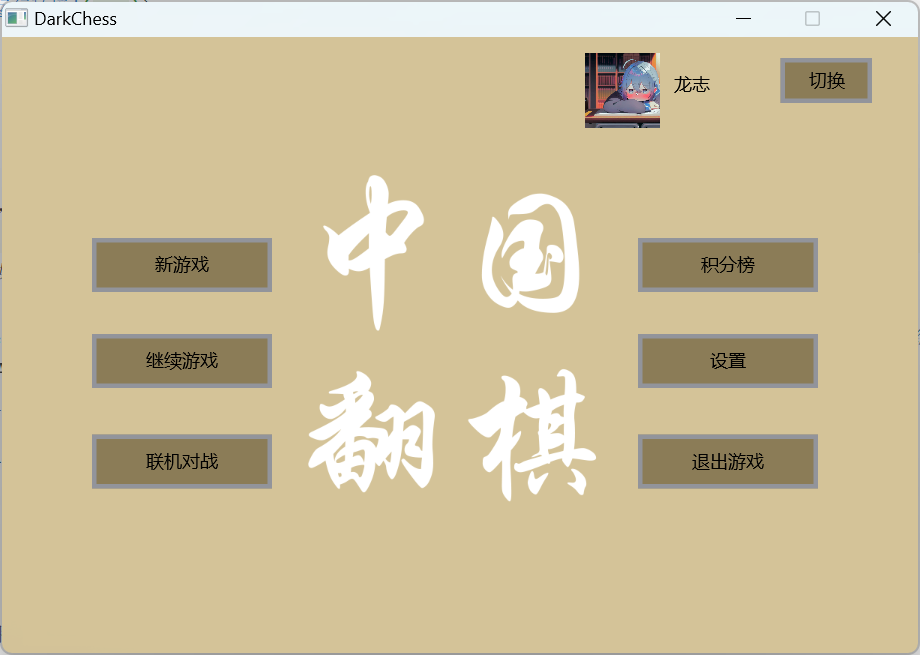

# 用户指南

### 快速开始

在 ```项目根目录/Publication/DarkChess```路径下可以看到DarkChess.exe，双击即可直接开始运行
（可能需要[JRE17运行环境](https://www.oracle.com/java/technologies/downloads/#java17)）

### 功能介绍

#### 主界面

如程序成功开始运行，用户应可看到如下界面



主菜单界面按键功能如下

- 新游戏/继续游戏：开启/加载本地游戏并进行，包括人机对战与本地双人游戏，具体使用可参考[本地游戏介绍](#本地游戏介绍)
- 联机对战：可在LAN内与其他用户进行联机游戏，具体使用可参考[联机游戏介绍](#联机游戏介绍)
- 积分榜：游戏历史记录（包括本地与联机游戏）
- 用户面板（右上）：本地游戏账户的切换，具体可参考 [用户面板与积分榜](#用户面板与积分榜)
- 设置：具体信息可参考 [视效,音乐,语言与设置](#视效音乐语言与设置)
- 退出游戏

#### 游戏规则

1. 初始时，棋盘上将随机打乱棋子的分布，所有棋子将棋面朝下摆放至棋盘中
2. 确定先手(红方)与后手(黑方)，两方轮流对棋盘进行操作，必须执行下述操作中的任意一个合法操作:
    1. 翻转棋盘中未翻转的棋子
    2. 移动我方棋子，其中可选择
        1. 除炮外，可将棋子任意移向 上/下/左/右 中的任意一个空格
        2. 除炮外，可按照下述子力顺序吃掉敌方子力较小的子，需注意 卒/兵 的子力最小，但只有这两种子可吃掉敌方的 将/帅
           需注意：除炮外不得吃掉未翻开的棋子
        3. 炮可以吃掉任意未翻开的棋子（无论其为我方还是敌方），对于揭开的棋子只可吃掉敌方棋子(无论子力)，在吃子时需间隔一子，
           不可吃相邻的子
        4. 炮可被除 兵/卒外的任意敌方棋子吃掉
3. 当敌方子被吃掉时，我方将会获得对应子的积分，先达到60积分的一方将获胜

子力顺序如下图所示


#### 本地游戏介绍

##### 新游戏

如需开始新一轮游戏，用户可点击 新游戏，选择本地对战或人机对战。人机对战可具体选择对应的AI等级（等级越高难度越大）与先后手


在游戏过程中，点击未翻转棋子即可执行翻子操作。点击我方棋子则可查看合法的移动操作（绿色框）


按下ESC按键可暂停游戏，用户可进一步选择所需操作，再次按下ESC可恢复游戏


可在游戏面板中看到游戏状态、当前积分与被吃子记录


在设置中可开启允许悔棋/作弊等功能。悔棋允许多步悔棋


##### 继续游戏

按下主菜单的继续游戏按钮后，用户可查看现有的游戏存档，并可点击对应的存档继续游戏


如勾选播放存档，则可在载入游戏时播放该存档先前的操作过程。在先前操作播放完后可继续游戏


#### 联机游戏介绍

点击主菜单的联机


房主填写未被占用的端口（通常大于1024）即可创建房间


玩家可填写房主的ip与端口即可连接房间，联机游戏支持多位玩家加入房间，除两名对决玩家外其余玩家将进入观战模式


房主点击开始游戏后，双方即可开始游戏对战


注: 该模块已实现游戏联机与观战功能，更多功能仍有待进一步的开发完善

#### 用户面板与积分榜

在主面板中点击积分榜按钮即可查看游戏的历史记录


主面板右上角为用户控制面板，可点击头像更换用户的头像


点击编辑可进入用户管理面板，可选择右下角的新增用户，点击用户可进行重命名、切换与删除等操作


#### 视效,音乐,语言与设置

在属性-画面中可切换界面主题风格与语言


(不同主题风格的展示)

在属性-音效中可开启背景音乐/音效的播放并选择音乐包


在任意一盘游戏中，用户均可在按下ESC后进行调整本盘游戏的音乐与视觉效果设置，如改变播放曲目，开启行子动画等，同时可对游戏进行截图
截图保存在```Userfile\Screenshot```路径下


(行子动画展示)

注: 用户可resources路径下添加资源以提升视觉与音乐效果，可修改主题风格包，修改棋子/背景的图像，
添加语言资源包，在```\Windows\Music```路径下可直接添加音乐资源

祝游戏愉快！